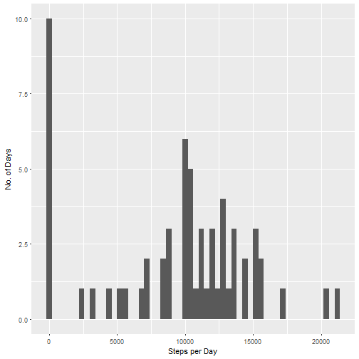
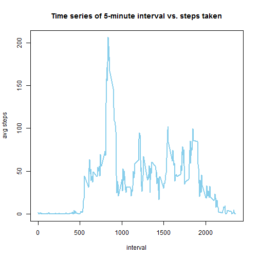
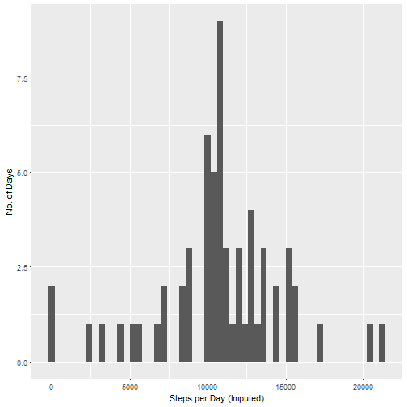
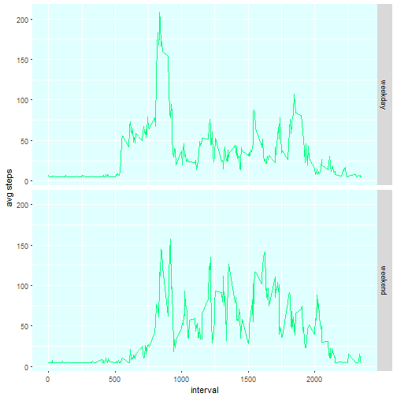

# Reproducible Research - Peer-graded Assignment: Course Project 1


## Loading and preprocessing the data

1. Load the data (i.e. read.csv())


```
## Loading required package: lattice
```

```
## Loading required package: survival
```

```
## Loading required package: Formula
```

```
## 
## Attaching package: 'Hmisc'
```

```
## The following objects are masked from 'package:base':
## 
##     format.pval, round.POSIXt, trunc.POSIXt, units
```


```r
if(!file.exists('activity.csv')){
      unzip('repdata_data_activity.zip')
}
activity <- read.csv('activity.csv')
```

2. Process/transform the data (if necessary) into a format suitable for your analysis


```r
activity$date <- as.Date(activity$date)
```


## What is mean total number of steps taken per day?

1. Calculate the total number of steps taken per day


```r
stepsPerDay <- tapply(activity$steps, activity$date, FUN = sum, na.rm = TRUE)
```

2. Make a histogram of the total number of steps taken each day


```r
qplot(stepsPerDay, xlab = "Steps per Day", ylab = "No. of Days", binwidth = 400)
```



3. Calculate and report the mean and median of the total number of steps taken per day


```r
stepsPerDayMean <- mean(stepsPerDay)  
stepsPerDayMedian <- median(stepsPerDay)
```

Mean steps per day: 9,354  
Median steps per day: 10,395


## What is the average daily activity pattern?

1. Make a time series plot (i.e. type = "l") of the 5-minute interval (x-axis) and the average number of steps taken, averaged across all days (y-axis)


```r
avgSteps <- aggregate(steps ~ interval, data = activity, FUN = mean, na.rm = TRUE)
plot(avgSteps$interval, avgSteps$steps, type = "l", lwd = 2, col = "skyblue", 
     main = "Time series of 5-minute interval vs. steps taken", xlab = "interval", 
     ylab = "avg steps")
```



2. Which 5-minute interval, on average across all the days in the dataset, contains the maximum number of steps?


```r
maxInt <- avgSteps$interval[which.max(avgSteps$steps)]
```

Interval containing maximum number of steps: 835


# Imputing missing values

1. Calculate and report the total number of missing values in the dataset (i.e. the total number of rows with NAs)


```r
NAs <- sum(is.na(activity))
```

Total number of rows with NAs: 2,304

2. Devise a strategy for filling in all of the missing values in the dataset.

3. Create a new dataset that is equal to the original dataset but with the missing data filled in.


```r
activityImputed <- activity
activityImputed$steps <- impute(activity$steps, fun = mean)
```

4. Make a histogram of the total number of steps taken each day and calculate and report the mean and median total number of steps taken per day.


```r
stepsPerDayImputed <- tapply(activityImputed$steps, activityImputed$date, FUN = sum)
qplot(stepsPerDayImputed, xlab = "Steps per Day (Imputed)", ylab = "No. of Days", binwidth = 400)
```




```r
stepsPerDayImputedMean <- mean(stepsPerDayImputed)
stepsPerDayImputedMedian <- median(stepsPerDayImputed)
```

Mean imputed steps per day: 10,766  
Median imputed steps per day: 10,766


# Are there differences in activity patterns between weekdays and weekends?

1. Create a new factor variable in the dataset with two levels - "weekday" and "weekend" indicating whether a given date is a weekday or weekend day.


```r
activityImputed$day <- weekdays(activityImputed$date)
activityImputed$dayType <- "weekday"
activityImputed[activityImputed$day == "Saturday" | activityImputed$day == "Sunday", ]$dayType <- "weekend"
activityImputed$dayType <- factor(activityImputed$dayType)
```

2. Make a panel plot containing a time series plot (i.e. type = "l") of the 5-minute interval (x-axis) and the average number of steps taken, averaged across all weekday days or weekend days (y-axis).


```r
avgStepsImputed <- aggregate(steps ~ interval + dayType, data = activityImputed, FUN = mean)
ggplot(avgStepsImputed, aes(interval, steps)) +
      geom_line(color = "springgreen") +
      facet_grid(dayType ~ .) +
      xlab("interval") +
      ylab("avg steps") +
      theme(panel.background = element_rect(fill = "lightcyan"))
```


